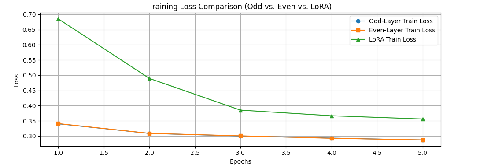
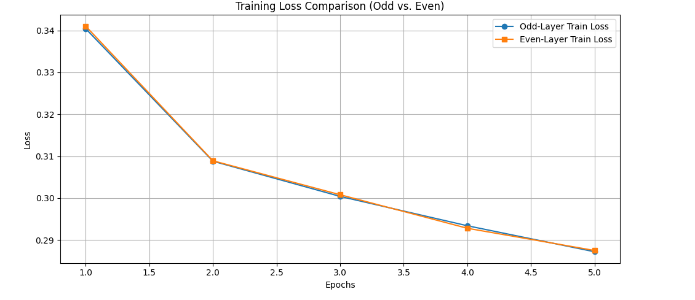
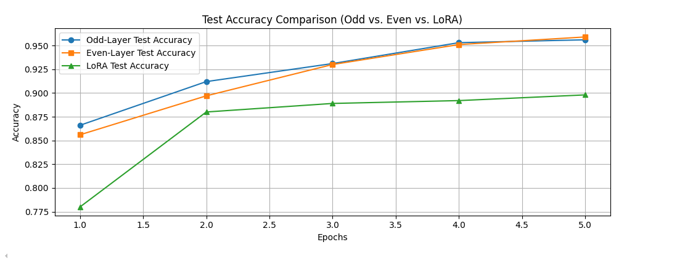
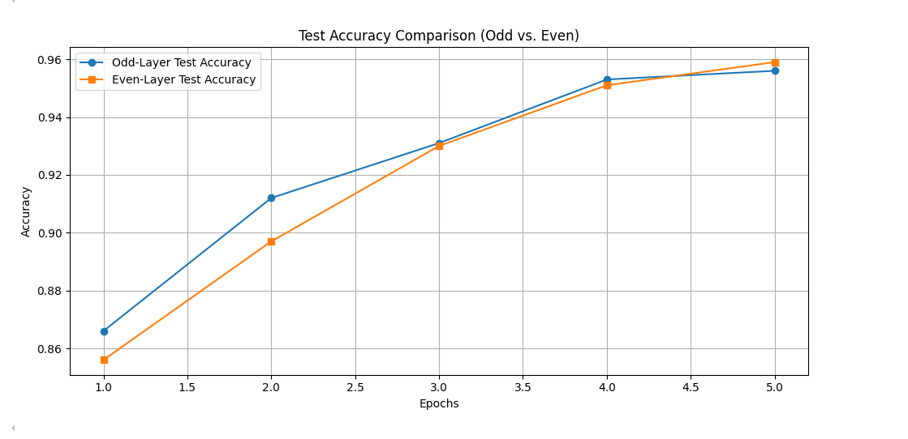
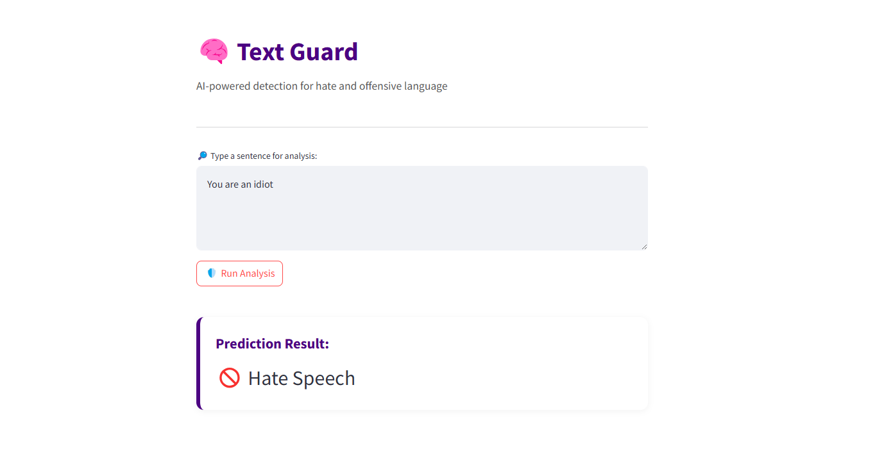
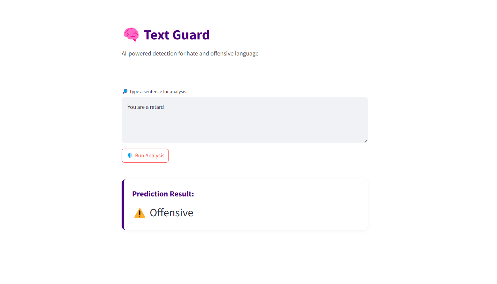

# NLP-A7-Distillation_vs_LoRA

In this assignment, we explore and compare the performance of **Odd-Layer** and **Even-Layer Student Training Models** against **LoRA (Low-Rank Adaptation)** on a distillation task using BERT models from Hugging Face.

🔗 **GitHub Repository**: [https://github.com/Minmarnko/A7_final](https://github.com/Minmarnko/A7_final)

---

## 📑 Contents
- [Student Information](#student-information)
- [Files Structure](#files-structure)
- [How to Run](#how-to-run)
- [Dataset](#dataset)
- [Model Training](#model-training)
- [Evaluation](#evaluation)
- [Final Decision](#final-decision)
- [Visualization](#visualization)
- [Web Application](#web-application)

---

## 👨‍🎓 Student Information
- **Name:** Min Marn Ko  
- **ID:** st125437  
- **Program:** DSAI

---

## 📁 Files Structure
```
A7_final/
│
├── distilBERT.ipynb                # Notebook for distillation training
├── app/
│   └── app.py                      # Streamlit Web App
├── Hate_Speech.png
├── offensive.png
├── Test_Accuracy_Comparison_of_Three_Models_new.png
├── Test_Accuracy_Comparison_of_Two_Models.png
├── Training_Loss_Comparison_of_Three_Models_new.png
├── Training_Loss_Comparison_of_Two_Models.png
```

---

## ▶️ How to Run

1. **Clone the Repository**
   ```bash
   git clone https://github.com/Minmarnko/A7_final.git
   cd A7_final
   ```

2. **Navigate to App Folder**
   ```bash
   cd app
   ```

3. **Run the Streamlit App**
   ```bash
   streamlit run app.py
   ```

4. The app will open at: [http://localhost:8501](http://localhost:8501)

---

## 📦 Dataset

We used the [Hate Speech and Offensive Language Dataset](https://huggingface.co/datasets/tdavidson/hate_speech_offensive), which includes:

- Tweets annotated as:
  - **Hate Speech (0)**
  - **Offensive Language (1)**
  - **Neither (2)**

We apply majority voting to resolve label conflicts and ensure consistent labels for supervised learning.

---

## 🧠 Model Training

- **Base Model:** `bert-base-uncased`
- **Student Variants:**  
  - 6-layer Student (Odd / Even Layers)  
  - 12-layer Student with **LoRA**

### 🔧 Optimizer & Scheduler

- Optimizer: **Adam**
- Learning Rate: **5e-5**
- Scheduler: **Linear Decay with Warmup**
- Warmup Steps: **10% of total training steps**

Each model uses its own optimizer and scheduler:
```python
optimizer = Adam(model.parameters(), lr=5e-5)
scheduler = get_scheduler("linear", optimizer=optimizer, num_warmup_steps=0, num_training_steps=total_steps)
```

### ⚙️ LoRA Configuration
```python
LoraConfig(
    task_type=TaskType.SEQ_CLS,
    r=8,
    lora_alpha=16,
    lora_dropout=0.1,
    target_modules=["query", "value"]
)
```

---

## 📊 Evaluation

### 🔹 Odd-Layer Student (Avg Accuracy: **0.9236**)

| Epoch | Train Loss | Eval Loss | Eval Accuracy |
|-------|------------|-----------|---------------|
| 1     | 0.3404     | 0.5989    | 0.8660        |
| 2     | 0.3088     | 0.5322    | 0.9120        |
| 3     | 0.3004     | 0.5190    | 0.9310        |
| 4     | 0.2934     | 0.4949    | 0.9530        |
| 5     | 0.2872     | 0.4854    | 0.9560        |

---

### 🔹 Even-Layer Student (Avg Accuracy: **0.9186**)

| Epoch | Train Loss | Eval Loss | Eval Accuracy |
|-------|------------|-----------|---------------|
| 1     | 0.3410     | 0.6424    | 0.8560        |
| 2     | 0.3089     | 0.5818    | 0.8970        |
| 3     | 0.3008     | 0.5158    | 0.9300        |
| 4     | 0.2928     | 0.5090    | 0.9510        |
| 5     | 0.2875     | 0.4750    | 0.9590        |

---

### 🔹 LoRA Student (Best Accuracy: **0.8980**)

| Epoch | Train Loss | Eval Loss | Eval Accuracy |
|-------|------------|-----------|---------------|
| 1     | 0.6851     | 0.5914    | 0.7800        |
| 2     | 0.4895     | 0.3673    | 0.8800        |
| 3     | 0.3853     | 0.3398    | 0.8890        |
| 4     | 0.3668     | 0.3291    | 0.8920        |
| 5     | 0.3561     | 0.3247    | 0.8980        |

---

## 🏁 Final Decision

While the Even-Layer model achieved slightly higher **final accuracy**, the **Odd-Layer Student** was chosen because it had:

- The **highest average accuracy (0.9236)**
- **More stable training behavior**
- Strong performance across all metrics

📌 **The Odd-Layer model was selected for the final web application.**

---

## 📈 Visualization

### 🔹 Training & Evaluation Curves

- **Training Loss - All Models**  
  

- **Training Loss - Odd vs Even**  
  

- **Test Accuracy - All Models**  
  

- **Test Accuracy - Odd vs Even**  
  

---

## 🌐 Web Application

This is a **Streamlit-based toxic comment classifier** that uses the final trained model to classify text as:

- Hate Speech  
- Offensive  
- Normal  

### 💡 Features:
- Real-time predictions
- Color-coded outputs
- Confidence scores for each class

### 🚀 How to Use:
```bash
streamlit run app.py
```

### 🖼️ Example Outputs:

- **Hate Speech Prediction**  
  

- **Offensive Speech Prediction**  
  

